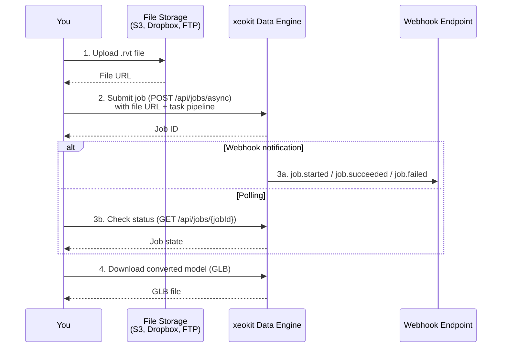

# xeokit-data-engine-samples

Sample scripts demonstrating the Xeokit Data Engine API capabilities. These examples help developers understand API endpoints, schema validation, and job submission workflows.

> **Important:** Before diving into these samples, please read the [ARCHITECTURE.md](ARCHITECTURE.md) for essential context, architecture overview, and best practices.

## Getting Started

### Prerequisites

- Node.js (v20 or higher recommended)
- pnpm (v10+)
- API credentials from Creoox AG

### Installation

1. Clone this repository:

   ```bash
   git clone <repository-url>
   cd xeokit-data-engine-samples
   ```

2. Install dependencies:

   ```bash
   pnpm install
   ```

3. **Request API credentials from Creoox AG** and configure your environment:

   ```bash
   cp .env.example .env
   ```

4. Edit `.env` and add your credentials:

   ```env
   XDES_API_URL=https://engine-eval.xeokit.io
   XDES_API_CLIENT_ID=your-client-id-here
   XDES_API_CLIENT_SECRET=your-client-secret-here
   XDES_EXTERNAL_WEBHOOK_SITE_TOKEN=your-unique-token
   ```

   > **Note:** Contact Creoox AG to obtain your `XDES_API_CLIENT_ID` and `XDES_API_CLIENT_SECRET` for API access.

### Webhook Testing

The Xeokit Data Engine uses **webhooks** for job progress notifications. You'll receive events like:

- `job.started` - Job execution has begun
- `job.succeeded` - Job completed successfully
- `job.failed` - Job encountered an error

> **Required for:** The `convertIfc2Xkt` and `convertRvt2Glb` samples require webhook configuration to run successfully.

**Testing Webhooks with webhook.site:**

For testing and development, use [webhook.site](https://webhook.site/) to receive webhook notifications:

1. Visit https://webhook.site/ and copy your unique URL (the token is visible in the browser URL)
2. Add it to your `.env` file:
   ```env
   XDES_EXTERNAL_WEBHOOK_SITE_TOKEN=your-unique-id
   ```
3. The conversion samples will automatically use this token to send webhook notifications
4. View incoming webhook events in real-time on the webhook.site interface

## Available Samples (TypeScript)

### `getSchemas` - Schema Discovery

Fetches and saves API data model schemas in multiple formats (JSON Schema, TypeScript).

**Use Case:** Understand API type models and generate type definitions for your project.

```bash
pnpm sample:getSchemas
```

**Output:** Schema files in `.sample-outputs/getSchemas/`

---

### `checkJobPayload` - Payload Validation

Validates Job payloads against the API schema before submission.

**Use Case:** Test and debug Job configurations, verify payload structure.

```bash
pnpm sample:checkJobPayload
```

**Output:** Validation results in `.sample-outputs/checkJobPayload/`

**Endpoint Behavior:**

- **Status 200:** Payload is valid (returns validated Job)
- **Status 400:** Payload is invalid (returns detailed error descriptions)

---

### `convertIfc2Xkt` - Full Conversion Workflow

Demonstrates a complete end-to-end file conversion workflow from IFC to XKT format, including job polling and file downloads.

**Use Case:** Convert BIM files (IFC) to web-optimized XKT format for 3D visualization.

```bash
pnpm sample:convertIfc2Xkt
```

**Features:**

- **Asynchronous job submission** with webhook notifications
- **Smart polling** with exponential backoff (1s, 2s, 4s, 8s, 16s)
- **Automatic file download** from completed tasks
- **ZIP extraction** for archived outputs
- **Job state persistence** for debugging

**Output:**

- Converted files in `.sample-outputs/convertIfc2Xkt/export-step-1/` and `export-step-2/`
- Job state in `job-state-{jobId}.json`

**Conversion Pipeline:**

1. Import IFC file from URL
2. Convert IFC → GLB (with metadata)
3. Convert GLB → XKT (web-optimized format)
4. Export and download all outputs

---

### `convertRvt2Glb` - RVT Conversion with Webhook Monitoring

Demonstrates RVT (Revit) to GLB conversion with real-time webhook monitoring via webhook.site.

**Use Case:** Convert Revit files to GLB format and monitor progress through webhook events.

```bash
pnpm sample:convertRvt2Glb
```

**Features:**

- **Asynchronous job submission** with webhook.site integration
- **Webhook monitoring** - Polls webhook.site for job events instead of direct API
- **Smart polling** - Checks every 5 seconds for up to 5 minutes
- **Event persistence** - Saves all webhook events to files
- **Automatic downloads** - Downloads GLB files when job succeeds

**Output:**

- Webhook events in `.sample-outputs/convertRvt2Glb/webhooks/`
- GLB files in `.sample-outputs/convertRvt2Glb/convert-step-1/`

**Conversion Pipeline:**

1. Import RVT file from URL
2. Convert RVT → GLB using xeoRvt
3. Monitor via webhook.site for completion
4. Download output files

---

## Available bash scripts

### `submit_job.sh` — Submit a job request

Submits a new job to the Xeokit Data Engine API for converting an RVT/IFC/STEP file to XKT format. Saves the job submission (initial Job state) response to `.sample-outputs/convertRvt2Xkt/`.

**Usage:**

```bash
Usage: ./src_bash/submit_job.sh --type <rvt|ifc|step> [--url <source_url>]

Options:
  --type    File type to convert (rvt, ifc, or step)
  --url     Optional source URL (uses default URL if not provided)

Examples:
  ./src_bash/submit_job.sh --type rvt
  ./src_bash/submit_job.sh --type ifc --url https://example.com/model.ifc
  ./src_bash/submit_job.sh --type step
```

---

### `check_status.sh` — Check job status

Fetches the status of a submitted job by job ID. Saves the current job state to `.sample-outputs/convertRvt2Xkt/`

**Usage:**

```bash
bash ./src_bash/check_status.sh <job_id>
```

---

## Converting Your Own Models

Once you're comfortable with the samples, here's how to convert your own files. (Revit file is presented, but flow is generic):



1. **Prepare your .rvt file** -- make it accessible via a URL (S3, Dropbox, FTP, or any public/pre-signed link). The API fetches the file directly from this URL.

2. **Submit a job** -- send a POST request to the API with a job definition. A job is a set of tasks that describe the pipeline: import your file, convert it, and export the result. See `src/samples/convertRvt2Glb.ts` for a working example you can adapt.

3. **Wait for completion** -- either poll the job status endpoint (`GET /api/jobs/{jobId}`) or set up a webhook to be notified when the job finishes (see [Webhook Notifications](#webhook-notifications) above).

4. **Download the result** -- once the job succeeds, download converter model. Look at example Job state bellow. During processing `xeokit-data-engine-server` append information about created artifacts/files like `fileType`, `fileSize`, `url`. You decide how to utilize those data in context of your implementation.

```
  ...
  "tasksWithContext": [
    {
      "id": "convert-step-1",
      "operation": "convert/rvt/glb",
      "input": "import-file",
      "engine": {
        "name": ...,
        "version": ...
      },
      "context": {
        "startedAt": ...,
        "endedAt": ...,
        "errors": [],
        "files": [
          {
            "path": "job/job_.../convert-step-1/container.glb",
            "fileType": "glb",
            "fileSize": 209524,
            "url": ".../job/job_.../convert-step-1/container.glb?expires=1.&signature=..."
          },
          {
            "path": "job/job_.../convert-step-1/container.json",
            "fileType": "xeokit-metadata",
            "fileSize": 238936,
            "url": ".../job/job_.../convert-step-1/container.json?expires=...&signature=..."
          }
        ]
      }
    },
  ]
  ...
```

For details on how jobs and tasks are structured, see [ARCHITECTURE.md](ARCHITECTURE.md)

---

## Development

### Run any sample:

```bash
pnpm sample:getSchemas
pnpm sample:checkJobPayload
pnpm sample:convertIfc2Xkt
pnpm sample:convertRvt2Glb
```

### Code quality:

```bash
pnpm lint          # Check code
pnpm format        # Format code
pnpm typecheck     # TypeScript validation
```

## Documentation

All sample scripts include comprehensive JSDoc documentation. Open any sample file in your IDE to see:

- Function signatures and parameters
- Usage examples
- Return types and error handling
- Endpoint behavior details

## Support

For API access, questions, or issues:

- **API Credentials:** Contact Creoox AG
- **Documentation:** See inline JSDoc comments in sample files
- **Webhook Testing:** Use https://webhook.site/ for development
